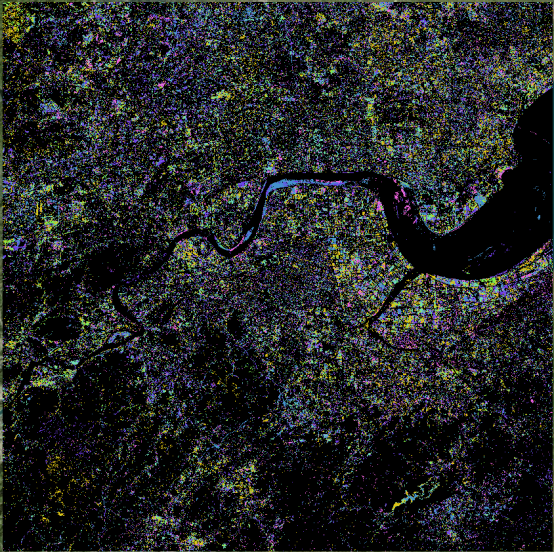

Pyxccd Tutorial
===============

This tutorial will guide you through processing HLS imagery data using
pyxccd to generate annual disturbance maps, recent disturbance maps, and
first disturbance maps. The workflow consists of three main steps.

Preparation
-----------

1. Install Required Python Libraries
~~~~~~~~~~~~~~~~~~~~~~~~~~~~~~~~~~~~

::

   pip install numpy pandas click rasterio pyxccd scipy...

2. Data Directory Structure
~~~~~~~~~~~~~~~~~~~~~~~~~~~

Prepare downloaded HLS files with the following structure (example
contains 6 years of HLS data from 2019-2024):

::

   HLS_root_directory/
   └── Tile_ID (e.g., 51RTP)/
   └── HLS_image_files (e.g., HLS.S30.T51RTP.2021001.v2.0.B02.tif)

3. Configuration File
~~~~~~~~~~~~~~~~~~~~~

Prepare ``config_hls.yaml`` with adjustable block size parameters
(example uses 30×30 blocks):

.. code:: yaml

   DATASETINFO:
     n_rows: 3660
     n_cols: 3660
     n_block_x: 30
     n_block_y: 30

Step 1: Image Stack Processing
------------------------------

Purpose
~~~~~~~

Stack HLS images in time series for subsequent change detection.

Procedure
~~~~~~~~~

1. Ensure tile list file ``tile_list`` contains target tile IDs (one per
   line, example uses 51RTP)

2. Run stacking script:

.. code:: bash

   python step1_stack.py --tile_list_fn ./tile_list \
                        --meta_path /path/to/hls/data \
                        --yaml_path ./config_hls.yaml \
                        --out_path /stack \
                        --low_date_bound 2019-01-01 \
                        --upp_date_bound 2024-12-31 \
                        --n_cores 16

Parameters
~~~~~~~~~~

::

   --tile_list_fn: Path to tile list file
   --meta_path: HLS data root directory
   --yaml_path: Configuration file path
   --out_path: Output directory for stacked data
   --low_date_bound: Start date (YYYY-MM-DD)
   --upp_date_bound: End date (YYYY-MM-DD)
   --n_cores: Number of CPU cores to use

Output
~~~~~~

The output directory (``stack`` by default) will contain
``{TileID}_stack`` folders with block-organized stacked data for each
tile.

Step 2: Change Detection (SCCD & COLD)
--------------------------------------

SCCD Algorithm
~~~~~~~~~~~~~~

Purpose
^^^^^^^

Detect pixel-level changes using pyxccd’s SCCD algorithm.

Procedure
^^^^^^^^^

1. Complete the stacking process (Step 1)
2. Run SCCD detection script:

.. code:: bash

   python step2_sccd.py --tile_list_fn ./tile_list \
                        --stack_path /stack \
                        --result_parent_path /sccd_results \
                        --yaml_path /config_hls.yaml \
                        --low_datebound 2019-01-01 \
                        --upper_datebound 2024-12-31 \
                        --n_cores 16

Parameters
^^^^^^^^^^

::

   --stack_path: Stacked data directory from Step 1
   --result_parent_path: Output directory for SCCD results
   (Other parameters same as Step 1)

Output
^^^^^^

The output directory (``sccd_results`` by default) will contain:

::

   record_change_x{blockX}_y{blockY}_sccd.npy: Change detection results per block
   SCCD_block{blockID}_finished.txt: Completion marker files

COLD Algorithm
~~~~~~~~~~~~~~

Purpose
^^^^^^^

Detect pixel-level changes using pyxccd’s COLD algorithm.

Procedure
^^^^^^^^^

1. Complete the stacking process (Step 1)
2. Run COLD detection script:

.. code:: bash

   python step2_cold.py --tile_list_fn ./tile_list \
                        --stack_path /stack \
                        --result_parent_path /cold_results \
                        --yaml_path ./config_hls.yaml \
                        --low_datebound 2019-01-01 \
                        --upper_datebound 2024-12-31 \
                        --n_cores 16

Parameters
^^^^^^^^^^

::

   --stack_path: Stacked data directory from Step 1
   --result_parent_path: Output directory for COLD results
   (Other parameters same as Step 1)

Output
^^^^^^

The output directory (``cold_results`` by default) will contain:

::

   record_change_x{blockX}_y{blockY}_cold.npy: Change detection results per block
   COLD_block{blockID}_finished.txt: Completion marker files

Step 3: Disturbance Map Generation
----------------------------------

Purpose
~~~~~~~

Convert change detection results into annual/recent/first disturbance
maps.

Procedure
~~~~~~~~~

1. Complete Steps 1-2
2. Run disturbance mapping script:

.. code:: bash

   python step3_disturbance_map.py --source_dir /hls \
                                  --result_path /sccd_results/51RTP_sccd \
                                  --out_path /disturbance_maps \
                                  --yaml_path /config_hls.yaml \
                                  --year_lowbound 2019 \
                                  --year_uppbound 2024 \
                                  --n_cores 16

Parameters
~~~~~~~~~~

::

   --source_dir: HLS root directory (for spatial reference)
   --result_path: SCCD results directory (specific to tile)
   --out_path: Output directory for disturbance maps
   --year_lowbound: Start year
   --year_uppbound: End year
   --n_cores: Number of CPU cores

Output
~~~~~~

The output directory (``disturbance_maps`` by default) will contain:

::

   {year}_break_map_SCCDOFFLINE.tif: Annual disturbance map
   recent_disturbance_map_SCCDOFFLINE.tif: Recent disturbance map (year of latest disturbance)
   first_disturbance_map_SCCDOFFLINE.tif: First disturbance map (year of first disturbance)

Interpretation
~~~~~~~~~~~~~~

Annual Disturbance Maps
^^^^^^^^^^^^^^^^^^^^^^^

::

   Pixel value = disturbance_type × 1000 + day_of_year
   Disturbance types:
     1 - Vegetation disturbance
     2 - Non-vegetation disturbance

Recent Disturbance Map
^^^^^^^^^^^^^^^^^^^^^^

::

   Shows the most recent disturbance year for each pixel
   0 indicates no disturbance

First Disturbance Map
^^^^^^^^^^^^^^^^^^^^^

::

   Shows the first disturbance year for each pixel
   0 indicates no disturbance

Important Notes
---------------

::

   For large areas, process tiles in batches to avoid memory overload

   Adjust block size parameters in config_hls.yaml to balance speed and memory usage

   Interrupted processing can be resumed - the script will skip completed blocks

Example Output
--------------

2019-2024 First Disturbance Map (SCCD)

   First Disturbance Map